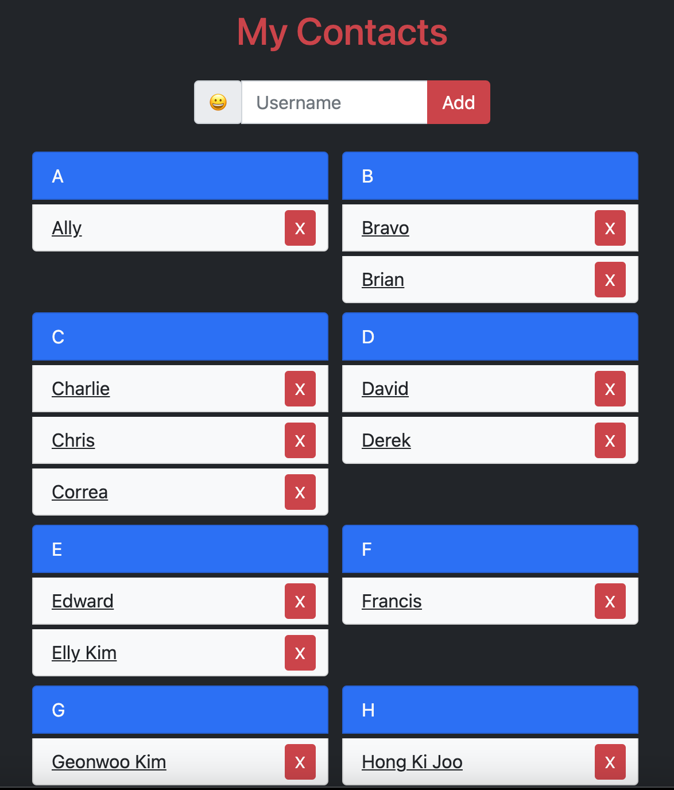
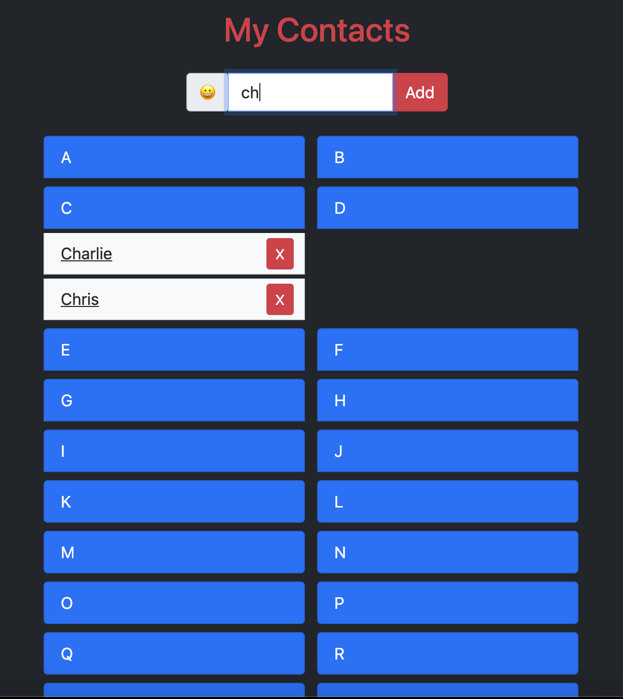
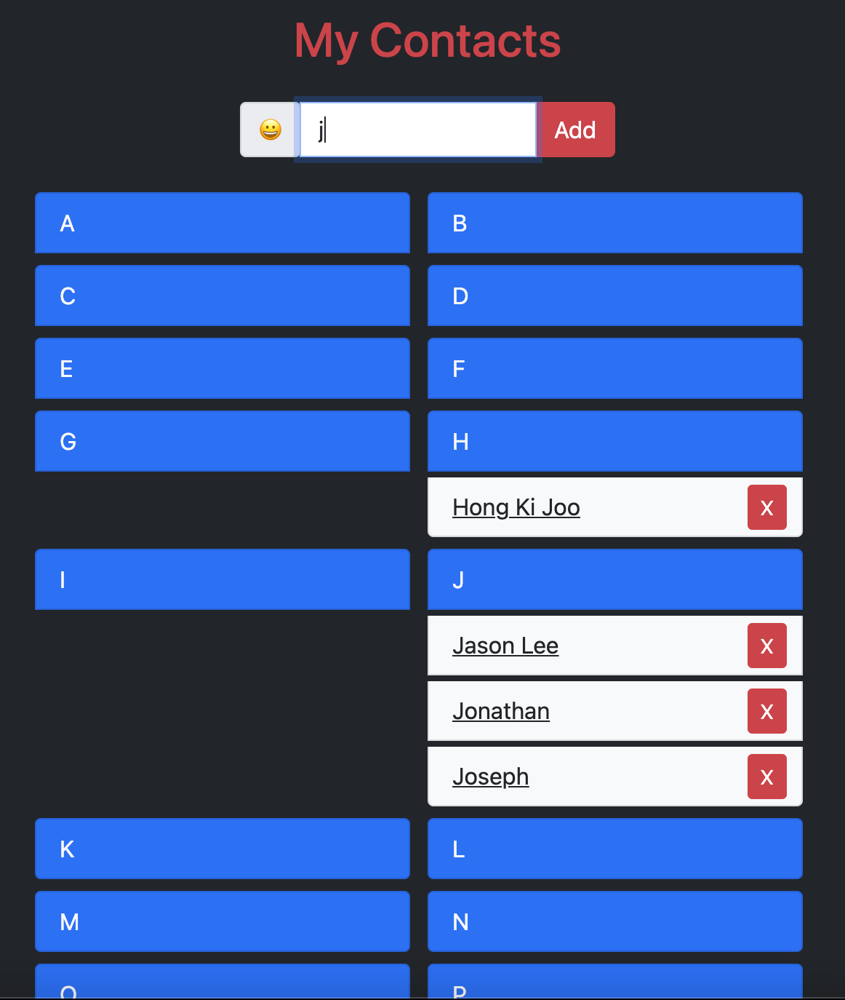

# Contact List :smiley:
### Link: https://jasonlee-cp.github.io/contact-list/

* The contact list made with **vanila javascript** offers you functions to add your friends to the card deck. The contact list puts the name card into deck in an **alphabetical** order. Each card section always remains alphabetically sorted for each add/remove operation.

* Another Feature is that when you type something in the input field, the contact list only shows the name cards which **include the input value as substring**.

